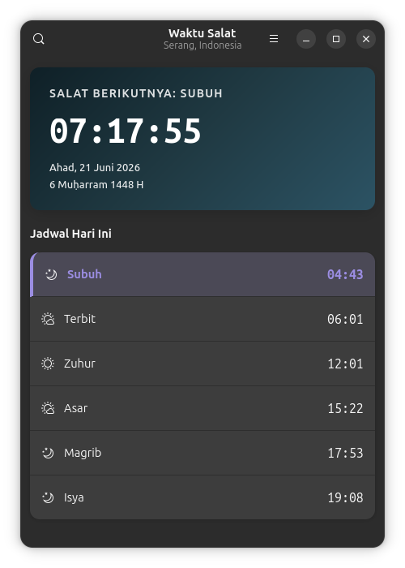
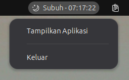

# Waktu Salat

A desktop prayer times app for Linux built using GTK 4 and Libadwaita. It runs in the background, displays prayer timetables, and alerts you when it is time to pray.

## Screenshots




## Features

- **Prayer Times**: Pulls data from Aladhan API or Kemenag (MyQuran ID) for Indonesia.
- **System Tray**: System tray indicator (GTK 3) that displays countdowns and Iqamah times.
- **Notis & Audio**: Desktop notifications via libnotify and a chime alert.
- **Bilingual**: Dynamic switching between Indonesian (KBBI-compliant) and English.
- **Autostart**: Option to launch automatically on login.

## Supported Languages

- **English**
- **Indonesian**

## Requirements

### Ubuntu / Debian / Pop!_OS
```bash
sudo apt install python3 python3-gi gir1.2-gtk-4.0 gir1.2-adw-1 gir1.2-ayatanaappindicator3-0.1 libcanberra-gtk-module libcanberra-gtk3-module
pip3 install requests
```

### Fedora / RHEL
```bash
sudo dnf install python3 python3-gobject gtk4 libadwaita libayatana-appindicator-gtk3
pip3 install requests
```

## Running the App

```bash
python3 main.py
```

Closing the main window minimizes the app to the system tray. Use the tray menu to show it again or quit.

## Project Structure

- `main.py` - Entry point
- `app.py` - GTK 4 app setup
- `window.py` - Main window and preferences UI
- `location_dialog.py` - Location search dialog
- `tray_helper.py` - System tray indicator (GTK 3 Ayatana AppIndicator)
- `i18n.py` - Translation dictionary and helper
- `settings.py` - Config manager (`~/.config/prayer-time/settings.json`)
- `api.py` - Asynchronous API calls

## Third-Party Services

- **Aladhan API** - Global prayer times data
- **MyQuran API** - Indonesian Kemenag prayer times data
- **Nominatim (OpenStreetMap)** - Geocoding and location search

## License

GPL-3.0. Copyright © 2026 Aska Erlangga.
