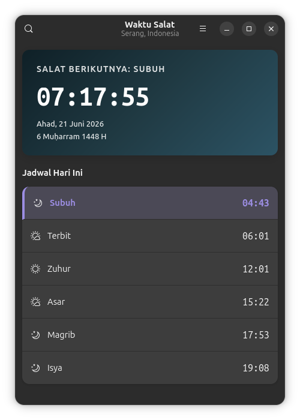
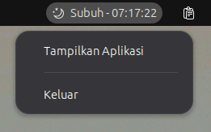

# Prayer Time

<p align="center">
  
</p>

A desktop prayer times app for Linux built using GTK 4 and Libadwaita. It runs in the background, displays prayer timetables, and alerts you when it is time to pray.

## Screenshots




## Features

- **Prayer Times**: Pulls data from Aladhan API or Kemenag (MyQuran ID) for Indonesia.
- **GNOME Shell Integration**: Seamless top bar clock indicator and calendar dropdown schedule card.
- **Notis & Audio**: Desktop notifications via libnotify and a chime alert.
- **Bilingual**: Dynamic switching between Indonesian (KBBI-compliant) and English.
- **Autostart**: Option to launch automatically on login.

## Supported Languages

- **English**
- **Indonesian**

## Installation & Setup

### Debian / Ubuntu (via APT Repository)

To get automatic updates, add the official APT repository:

```bash
# 1. Add the repository GPG key
wget -qO- https://askaerlangga.github.io/prayer-time/apt/key.gpg | gpg --dearmor | sudo tee /usr/share/keyrings/prayer-time-archive-keyring.gpg > /dev/null

# 2. Add the APT repository
echo "deb [signed-by=/usr/share/keyrings/prayer-time-archive-keyring.gpg] https://askaerlangga.github.io/prayer-time/apt/ ./" | sudo tee /etc/apt/sources.list.d/prayer-time.list

# 3. Update and install the application
sudo apt update && sudo apt install prayer-time
```

### Manual Installation (Debian / Ubuntu)

Download the latest `.deb` package from the [Releases](https://github.com/askaerlangga/prayer-time/releases) page and run:

```bash
sudo apt install ./prayer-time_*.deb
```

---

## Development Setup

If you want to run the application from source, install the following dependencies:

### Debian / Ubuntu
```bash
sudo apt install python3 python3-gi gir1.2-gtk-4.0 gir1.2-adw-1 gir1.2-notify-0.7 libcanberra-gtk-module libcanberra-gtk3-module
pip3 install requests
```

### Fedora / RHEL
```bash
sudo dnf install python3 python3-gobject gtk4 libadwaita libnotify
pip3 install requests
```

### Running the App from source

```bash
python3 main.py
```

## GNOME Shell Extension (Clock Integration)

To integrate prayer time countdown and calendar schedule card into your GNOME Shell top bar:

```bash
cd extension
./install.sh
```

Restart GNOME Shell (`Alt`+`F2`, type `r` and press Enter on X11, or log out and log back in on Wayland) and enable the extension if needed.

## Project Structure

- `main.py` - Entry point
- `data/` - Layout resources (`style.css` and screenshots)
- `extension/` - GNOME Shell Extension (Clock & Calendar integration)
- `prayer_time/` - Core application package
  - `app.py` - GTK 4 application class
  - `settings.py` - Config manager (`~/.config/prayer-time/settings.json`)
  - `i18n.py` - Dynamic bilingual dictionary
  - `api.py` - Asynchronous API caller
  - `ui/` - Interface components (Window, Preferences, Location Dialog)

## Third-Party Services

- **Aladhan API** - Global prayer times data
- **MyQuran API** - Indonesian Kemenag prayer times data
- **Nominatim (OpenStreetMap)** - Geocoding and location search

## License

GPL-3.0. Copyright © 2026 Aska Erlangga.

